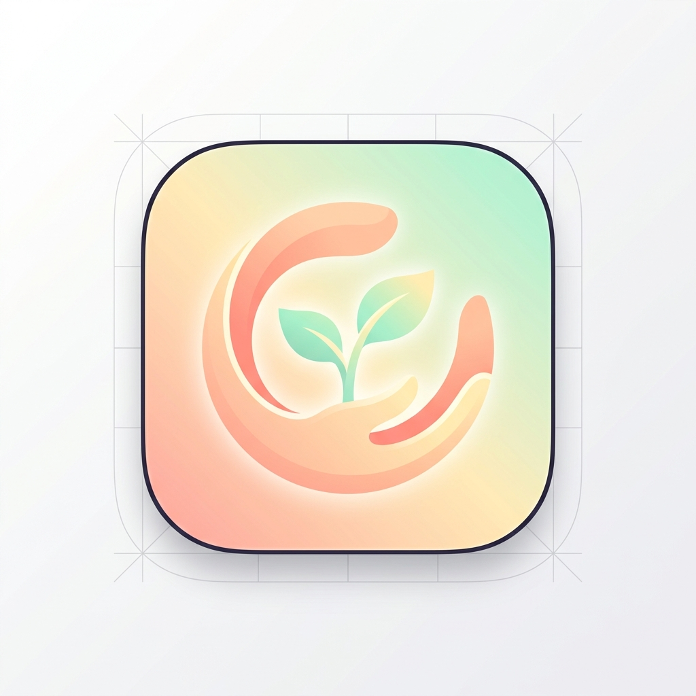
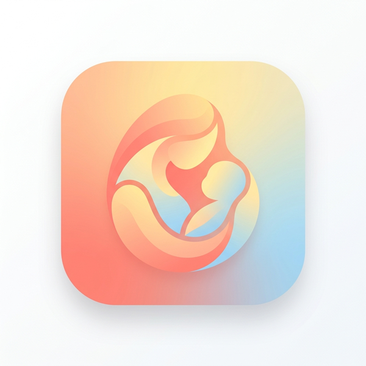

# ChildInfo 앱 로고 시안

작업하신 에디터(VS Code 등)에서 이 마크다운 파일을 여시고 **마크다운 미리보기 기능**을 사용하시면 이미지를 편하게 확인하실 수 있습니다.

## 1. 첫 번째 시안 (Sprout Embrace)
부드러운 손길이나 포근한 품이 자라나는 새싹(아이의 성장)을 감싸고 있는 듯한 형상입니다. 피치, 옐로우, 민트 그린과 같은 따뜻하고 편안한 색감을 사용했습니다.

---

## 2. 두 번째 시안 (Abstract Care)
각진 곳 없이 부드럽게 이어지는 추상적인 곡선들이 서로 안고 있는 듯한 모습을 표현했습니다. 코랄, 햇살 같은 노란색, 베이비 블루가 섞인 은은한 그라데이션이 특징입니다.

